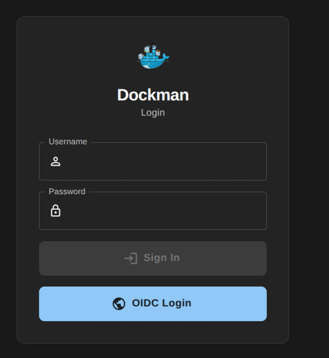

This section outlines how to configure authentication for Dockman.

Dockman supports two authentication methods: Basic Authentication and OpenID Connect (OIDC).

:::warning Security Recommendation
Regardless of the authentication method chosen, NEVER expose Dockman directly to the internet.

It is recommended to keep Dockman isolated to your local network and use a VPN (such as [Netbird](https://netbird.io/)
or [Tailscale](https://tailscale.com/)) for remote access.
:::

## Basic Authentication

To enable standard username and password authentication, add the following environment variables to your
`docker-compose.yml` or `.env` file:

```yaml
DOCKMAN_AUTH_ENABLE: "true"
DOCKMAN_AUTH_USERNAME: "admin"
DOCKMAN_AUTH_PASSWORD: "your-secure-password"
```

## OIDC

:::important
OIDC support requires Dockman **v2.5** or higher.
:::

To configure OIDC, you need an HTTPS instance of an OIDC provider
(like [Pocket-ID](https://pocket-id.org/), [Keycloak](https://www.keycloak.org/),
or [Authentik](https://goauthentik.io/)).

### 1. Configure Provider

Create a new application in your OIDC provider. When asked for the **Callback** or **Redirect URL**, use the following
format:

#### v3+ use

Note the `/api` is added

`http://<your-dockman-url>/api/auth/login/oidc/callback`

#### v2 use

`http://<your-dockman-url>/auth/login/oidc/callback`

#### Examples

* ```
  http://localhost:8866/api/auth/login/oidc/callback
  ```
* ```
  https://dockman.test.com/api/auth/login/oidc/callback
  ```

It is important that the above url is also the same when setting the `DOCKMAN_AUTH_OIDC_REDIRECT_URL` env

#### Icon

You can set the dockman app icon for provider using this url

```
https://raw.githubusercontent.com/RA341/dockman/refs/heads/main/ui/public/dockman.svg
```

### 2. Configure Dockman

Add the following variables to your `docker-compose.yml` or `.env` file using the Client ID and Secret generated by your
provider:

```yaml
DOCKMAN_AUTH_ENABLE: "true"
DOCKMAN_AUTH_OIDC_ENABLE: "true"
DOCKMAN_AUTH_OIDC_ISSUER: "https://auth.example.com"
DOCKMAN_AUTH_OIDC_CLIENT_ID: "a56d5b8f-1801-4311-a6e6-ce69b4b1d7d2"
DOCKMAN_AUTH_OIDC_CLIENT_SECRET: "lUZvQ914A4YzdrONc3mCYrtXUoObYetl"
DOCKMAN_AUTH_OIDC_REDIRECT_URL: "http://localhost:8866/api/auth/login/oidc/callback"
```

If you encounter issues, please open a [discussion on GitHub](https://github.com/RA341/dockman/discussions).

### Prevent auto redirect

By default, once OIDC is enabled dockman will automatically redirect you to your provider

You can disable this by setting

```
DOCKMAN_AUTH_OIDC_AUTO_REDIRECT: false
```

Once set you choose which method to use on the login page



## Customizing sessions

You can further customize auth sessions using the following envs

1. Set the max cookie validity for a session
    * A duration string consists of a possibly signed sequence of decimal numbers,
      each with an optional fraction and a unit suffix, such as `300ms`, `-1.5h`, or `2h45m`.
    * Valid time units are `ns`, `us` (or `µs`), `ms`, `s`, `
      m`, and `h`.
    *
      ```
      DOCKMAN_AUTH_EXPIRY = 24h # logged out after a day 
      ```
2. Maximum concurrent sessions for a user
   ```
    DOCKMAN_AUTH_MAX_SESSIONS = 5 # oldest session is automtially removed
   ```

