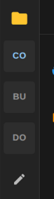

# File Aliases

File aliases provide a convenient way to browse and edit files in any directory on your host system directly from the
Dockman interface, without the need for manual SSH connections or command-line navigation.

**Example use cases:**

- Edit application configuration files stored in `/opt/appdata`
- Browse and manage media files in `/mnt/storage`
- Access log files in `/var/log`
- Modify container data directories

## How It Works

File aliases work by mapping directories you've already mounted in your Dockman container. Once mounted and aliased,
these directories become accessible through the file explorer interface, allowing you to view, edit, upload/download and
manage files as if they were part of your compose directory structure.

## Setup Guide

### Step 1: Mount the Directory

First, you need to mount the host directory into your Dockman container. This is done by adding a volume mount in your
`docker-compose.yml` file.

:::important
It's recommended to keep both sides of the mount identical (using the same path on both host and
container). This prevents confusion and makes troubleshooting easier.

:::

**Example:** To access `/home/zaphodb/appdata` from your host:

```yml
services:
  dockman:
    image: ghcr.io/ra341/dockman:latest
    volumes:
      - /home/zaphodb/stacks:/home/zaphodb/stacks
      - /home/zaphodb/config/dockman:/config
      - /var/run/docker.sock:/var/run/docker.sock
      - /home/zaphodb/appdata:/home/zaphodb/appdata  # <- your new mount
```

In this mount syntax:

- **Left side** (`/home/ra341/Pictures`): The path on your host machine
- **Right side** (`/home/ra341/Pictures`): The path inside the Dockman container

After adding the mount, restart your Dockman container for the changes to take effect:

```bash
docker compose down && docker compose up -d
```

### Step 2: Create the Alias

In the file list click on the edit button in the sidebar


:::important
Use the *container path* (the right side of your mount) when creating the alias. In our example, this
would be `/home/ra341/Pictures`.
:::


You can give your alias a friendly name (like "appdata" or "media") to make it easier to identify in the file
explorer.

### Step 3: Access Your Files

Once configured, your alias will appear in the file explorer sidebar, allowing instant access to your mounted directory.



## Tips

- **Multiple aliases**: You can create as many aliases as needed for different directories
- **Permissions**: Ensure the Dockman container has appropriate read/write permissions for mounted directories
- **Path consistency**: Using identical paths on both sides of the mount (e.g., `/path/on/host:/path/on/host`) helps
  avoid confusion when troubleshooting
- **Security**: Only mount directories that You want Dockman to access, following the principle of least privilege
```
