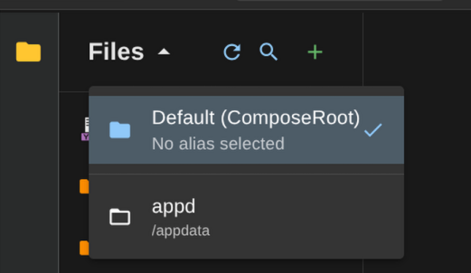

# File Aliases

File aliases let you browse and edit files outside your compose root directory.

Handy for accessing Docker data folders or config files without SSH.

**Example use cases:**

- Edit container configs stored in `/var/lib/docker`
- Modify app data in `/opt/appdata`
- Access media files in `/mnt/storage`

## Setup

**1. Mount the directory**

Say you want to access `/home/zaphodb/appdata`:

```yml
services:
  dockman:
    image: ghcr.io/ra341/dockman:latest
    volumes:
      - /home/zaphodb/stacks:/home/zaphodb/stacks
      - /home/zaphodb/config/dockman:/config
      - /var/run/docker.sock:/var/run/docker.sock
      - /home/zaphodb/appdata:/appdata  # <- your new mount
```

**2. Add the alias**

Head to Settings and create an alias. Use the *container path* (right side of the mount) — in this case `/appdata`.


**3. Use it**

Your alias now appears in the file explorer dropdown:



Switch between locations anytime. Default is always your compose root.
